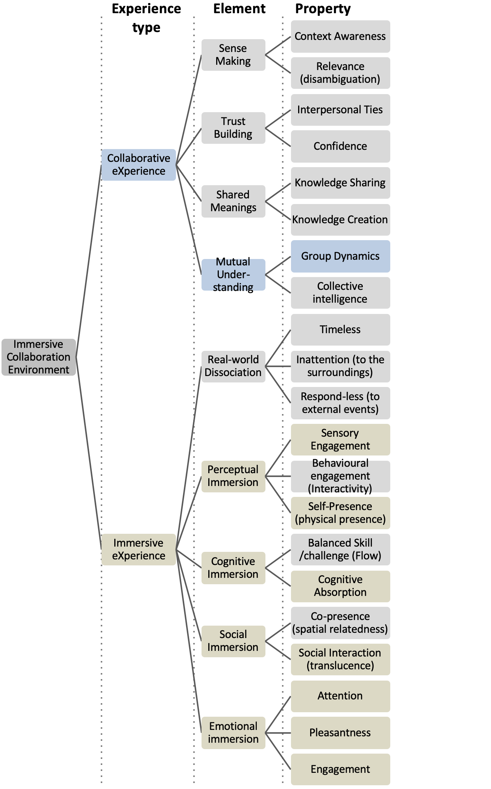

```{r setup, include=FALSE}
knitr::opts_chunk$set(echo = FALSE)

# Learn more about creating websites with Distill at:
# https://rstudio.github.io/distill/website.html

```

## Analyzing digital mediated collaborations

We are concerned with how to make people collaborate in digital platforms, how to raise empathy, how to create, motivate or manage initiatives, how to encourage responsibility to engage people with problems.

To investigate this, in the paper **Digital Collaborations for the Common Good: Key Learnings from Four Community Projects** we analyzed four digital collaborative projects found in the literature to understand how the collaboration is mediated and to examine their opportunities and challenges.

The analysis of the cases was done through the lenses of a theoretical framework for collaboration in immersive environments which helps us to better understand the different factors affecting the collaboration. Revealing how those factors play a role in each case allows us to understand how to encourage and facilitate digital collaborations.

## The model

The ICE (Immersive collaborative environment) model was made to conceptualize and measure collaborations mediated by immersive environments and thus digital technologies.

The model was proposed by [@Dupont2018a],[@Dupont2017a],[@Pallot2017b] and its composed by two main parts, one concerned with **immersion** and the other with **collaboration**; is mainly the latter we are going to discuss here .



### The collaborative experience

For the collaboration component the model proposes four elements, each of them with two properties: Sense Making (SMa): Relevance (SmaR), Context Awareness (SMCA);

-   Trust Building (TB): Interpersonal Ties (TBIT), Confidence (TBC);

-   Shared Meanings (SMe): Knowledge Sharing (SMEKS), Knowledge Creation (SMeKC);

-   Mutual Understanding (MU): Group Dynamics (MUGD), Collective Intelligence (MUCI).
